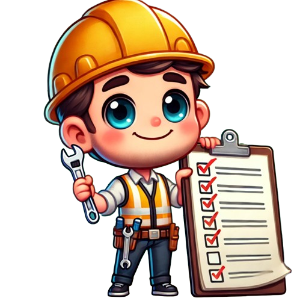
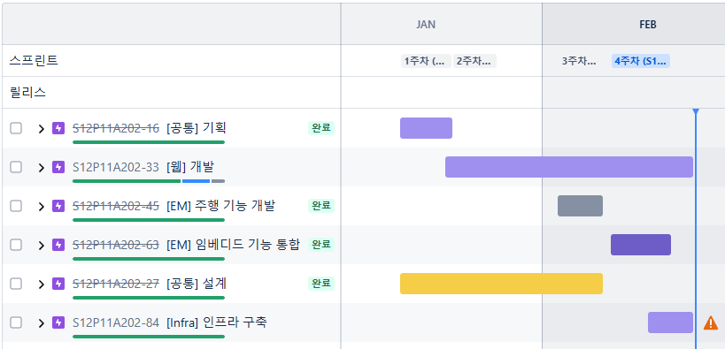
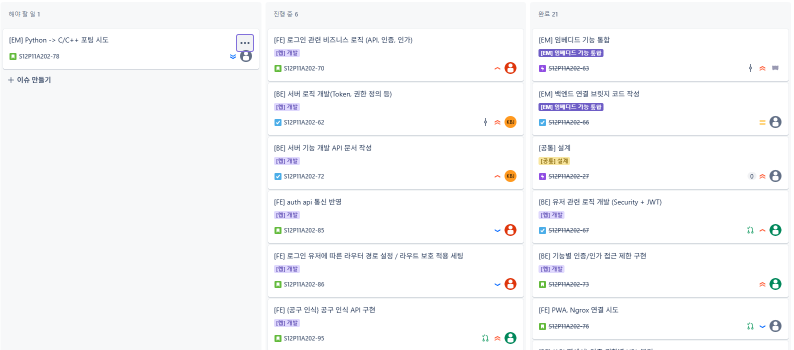
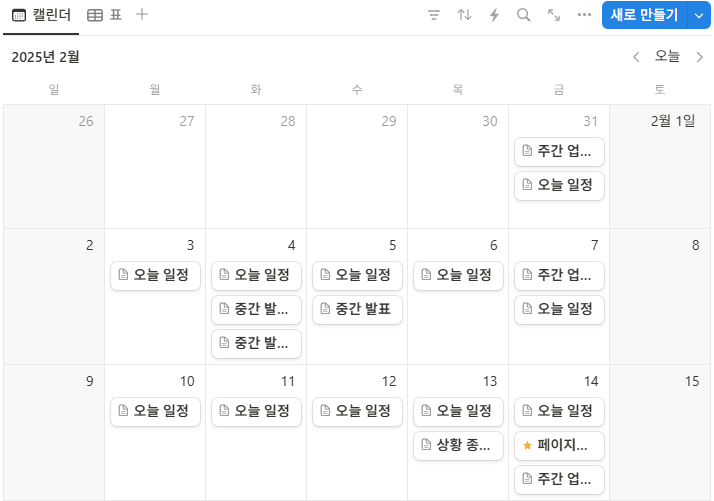
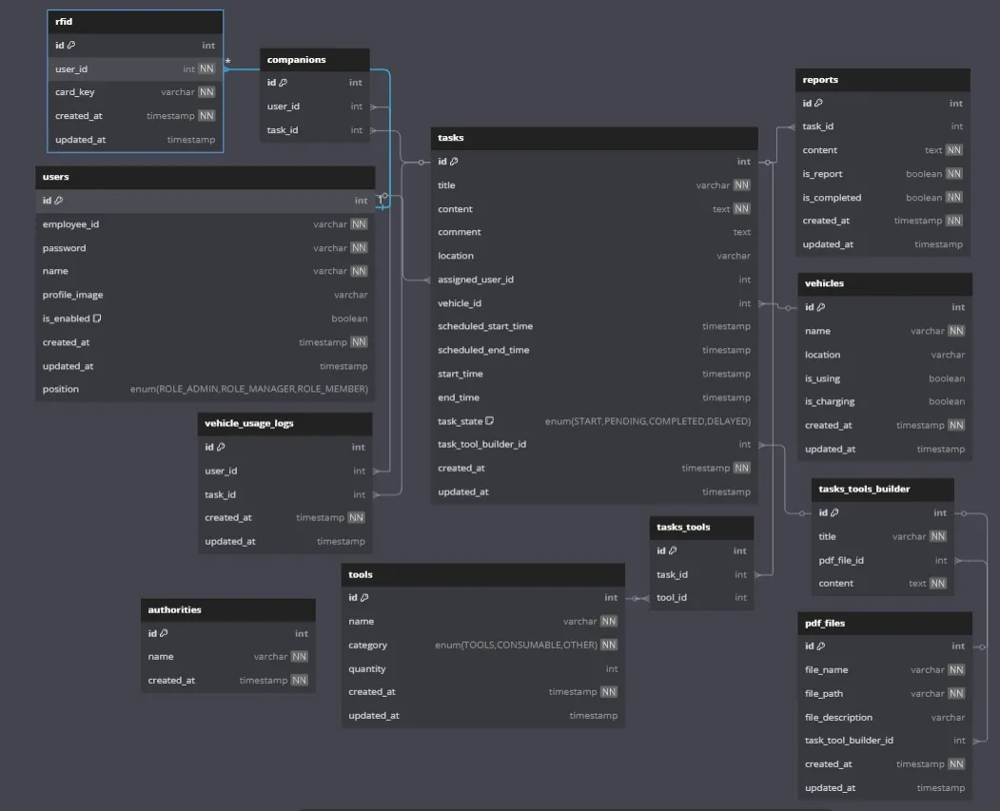
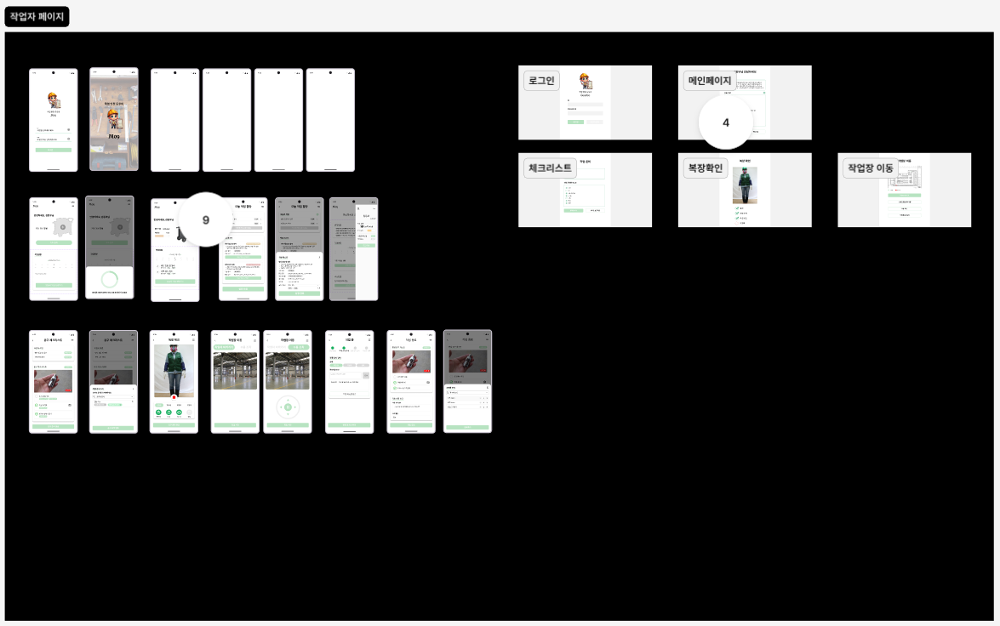
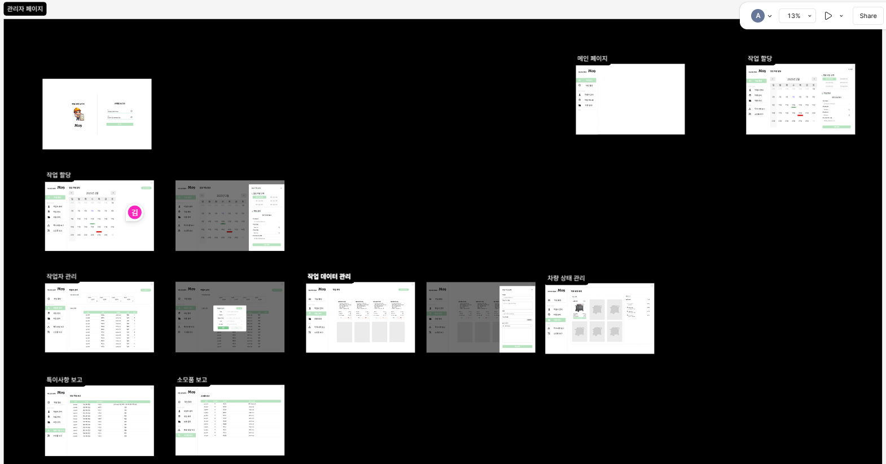
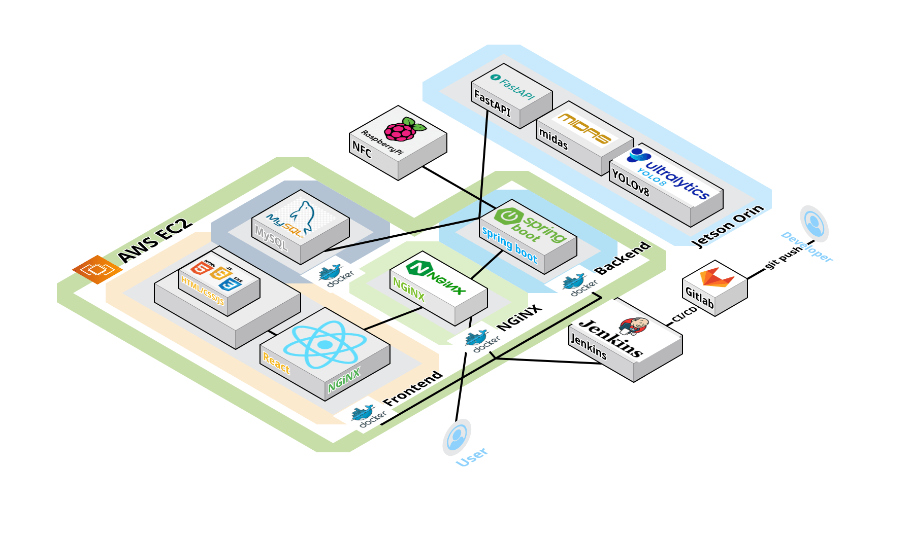
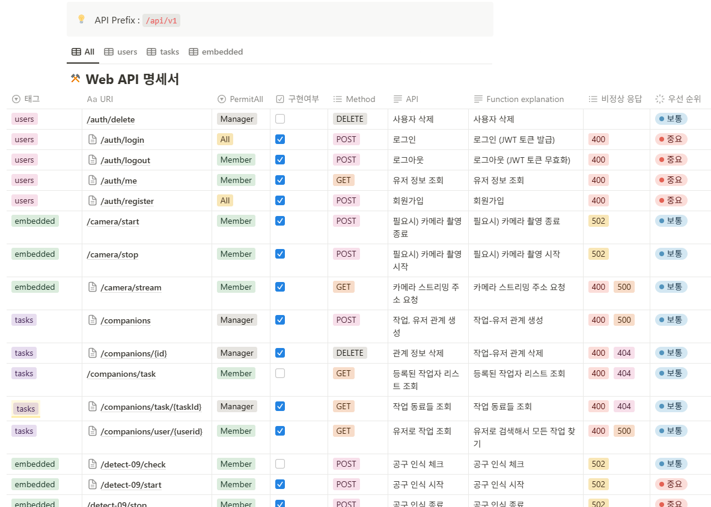

# 🚀 M09 프로젝트

**AIoT 작업현장 보조 서비스** 
배포된 링크 : https://i12a202.p.ssafy.io

### 📆 프로젝트 진행 기간

2025.01.13 ~ 2025.02.21 (총 3주)

## 🎯 프로젝트 개요

삼성 청년 SW 아카데미 12th 
2학기 공통 프로젝트

### ⭐ 프로젝트 특징

- **AIoT를 활용한 무인 주행 시스템 개발**

- **항공 산업 작업자가 작업 전에 공구를 빼먹지 않고 무겁고 비싼 공구들을 손쉽게 운반**

- **NVIDIA Jetson Orin Nano 보드와 YOLOv8 모델, MIDAS 라이브러리를 사용한 추종 자율 주행 구현**

- **Spring Boot와 React, FastAPI를 사용한 웹 페이지 구현**

- **Raspberry Pi 5와 NFC를 이용한 센서 로그인**

### 👨‍👩‍👧‍👦 팀원 소개

<table>
  <thead>
    <tr>
      <th style="text-align: center;"><strong>팀장/AI</strong></th>
      <th style="text-align: center;"><strong>BE/Infra</strong></th>
      <th style="text-align: center;"><strong>FE</strong></th>
      <th style="text-align: center;"><strong>EM/BE</strong></th>
      <th style="text-align: center;"><strong>EM/AI</strong></th>
      <th style="text-align: center;"><strong>EM/BE</strong></th>
    </tr>
  </thead>
  <tbody>
    <tr>
      <td style="text-align: center;">
        <a href="#">
           
        </a>
      </td>
      <td style="text-align: center;">
        
      </td>
      <td style="text-align: center;">
        
      </td>
            <td style="text-align: center;">
        
      </td>
            <td style="text-align: center;">
        
      </td>
            <td style="text-align: center;">
        
      </td>
    </tr>
    <tr>
      <td>
        
<a href="#">목경민</a>

      </td>
      <td>
        
<a href="https://github.com/SorrowAddict">정도영</a>

      </td>
            <td>
        
<a href="#">김민지</a>

      </td>
            <td>
        
<a href="#">김병지</a>

      </td>
            <td>
        
<a href="#">염정우</a>

      </td>
            <td>
        
<a href="#">이승록</a>

      </td>
    </tr>
  </tbody>
</table>

## 🖥️ 주요 기술

  
   
  
   
   
   
   

  
  
  
  
   
  
  
   

   
    
  
  
  
  
   
  
  
  
  
   
   

---

## 📆 프로젝트 일정 관리

## 🗂 ERD

## 🗂️ 프로젝트 구성

### 🎨 와이어 프레임

.png)

### 💥 시스템 아키텍처

### 📜 API 명세서

## 🔍 M09 프로젝트 회고

### 📈 성과

- **목표 달성**: 프로젝트의 모든 주요 목표를 성공적으로 달성하였습니다.
- **기술 습득**: 다양한 최신 기술을 습득하고 실무에 적용할 수 있는 경험을 쌓았습니다.
- **팀워크 향상**: 팀원 간의 협업 능력이 크게 향상되었습니다.

### 🛠️ 개선점

- **시간 관리**: 프로젝트 일정 관리에 있어 좀 더 효율적인 시간 관리가 필요했습니다.
- **테스트 강화**: 테스트 케이스를 더 많이 작성하여 안정성을 높일 필요가 있었습니다.
- **문서화**: 프로젝트 문서화를 좀 더 체계적으로 진행할 필요가 있었습니다.

### 📚 배운 점

- **AIoT 통합**: AI와 IoT 기술을 통합하여 실제 문제를 해결하는 방법을 배웠습니다.
- **자율 주행**: 자율 주행 시스템의 기본 개념과 구현 방법을 익혔습니다.
- **웹 개발**: 백엔드와 프론트엔드 개발의 전반적인 흐름을 이해하고 경험했습니다.

### 🎯 앞으로의 계획

- **기술 심화**: 이번 프로젝트에서 사용한 기술들을 더 깊이 있게 학습할 계획입니다.
- **프로젝트 확장**: 현재 프로젝트를 기반으로 기능을 확장하고 고도화할 예정입니다.

---

지금까지 팀 prefix의 M09였습니다.

감사합니다.