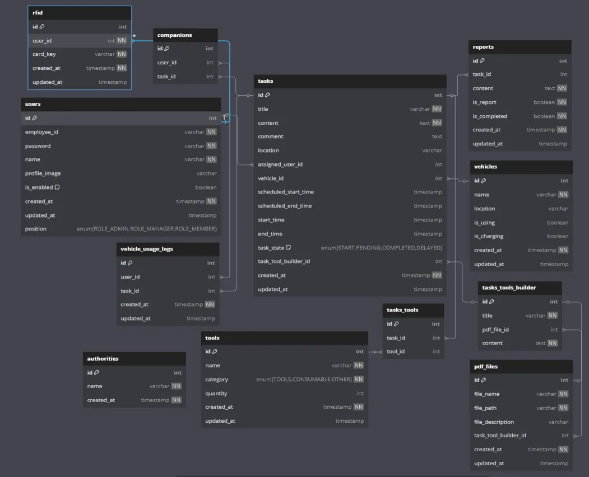

# 🚀 M09 프로젝트

## 📋 1. Gitlab 소스 클론 이후 빌드 및 배포 문서

### 🔧 개발 환경

#### 사용 기술 스택 및 버전
- **JVM**: Amazon Corretto 17 (로컬), amazoncorretto:17 (Docker)
- **웹서버**: 
  - React + Nginx (프론트엔드)
  - Nginx (리버스 프록시)
- **WAS**: Spring Boot 내장 Tomcat
- **IDE**:
  - Visual Studio Code 1.97
  - IntelliJ Ultimate 2024.3.3
- **빌드 도구**:
  - 프론트엔드: Vite
  - 백엔드: Gradle
- **프레임워크 및 주요 라이브러리**:
  - Spring Boot 3.4.2
  - React
- **데이터베이스**: MySQL 8.0.41
- **OS**: Ubuntu

### 🔑 빌드 시 사용되는 환경 변수

#### 백엔드(Spring Boot)
- `application.properties` 파일에서 다음 환경 변수 설정 필요:
  - `spring.datasource.url`: 데이터베이스 연결 URL

#### 프론트엔드(React)
- `.env` 파일에서 다음 환경 변수 설정 필요:
  - `VITE_API_URL`: 백엔드 API 요청 URL
  - `VITE_STREAM_URL`: 스트리밍 서비스 URL
  - `VITE_WS_URL`: 웹소켓 서비스 URL

#### 임베디드(라즈베리파이 및 젯슨 오린 보드)
- `.bashrc` 파일에 백엔드 요청 관련 환경 변수 설정 필요

### 🚢 빌드 및 배포 방법

#### 수동 배포
```bash
# 캐시 없이 도커 이미지 빌드
docker-compose build --no-cache

# 도커 컨테이너 백그라운드에서 실행
docker-compose up -d
```

#### Jenkins CI/CD 구성
- Jenkins 서버 접근 포트: 9090:8080
- 배포 과정:
  1. Jenkins credentials에서 Gitlab 토큰값 로딩
  2. SSH 공개 키를 이용하여 서버 접속
  3. 최신 코드 pull
  4. 기존 컨테이너 중지: `docker-compose down`
  5. 캐시 없이 빌드: `docker-compose build --no-cache`
  6. 컨테이너 실행: `docker-compose up -d`

### 🐳 Docker 구성
- `docker-compose.yml`로 관리되는 4개의 컨테이너:
  1. `frontend`: React + Nginx (포트: 3000)
  2. `backend`: Spring Boot (포트: 8080)
  3. `embedded`: 임베디드 시스템 서버 (포트: 8765)
  4. `nginx`: 리버스 프록시 서버 (포트: 80, 443)

### 🔄 Nginx 설정 (리버스 프록시)
- HTTPS 리다이렉션 및 SSL 설정
- Let's Encrypt SSL 인증서 사용
- 요청 제한(rate limiting) 구성:
  - 일반 접근: 30 요청/분 (burst=30)
  - API 접근: 60 요청/분 (burst=20)
  - 스트림 접근: 5 요청/분 (burst=5)
- 주요 프록시 경로:
  - `/api` → `http://backend:8080/api`
  - `/stream` → `http://embedded:8765/barebone/camera/stream`
  - `/socket.io/` → `http://embedded:8765/socket.io/`
  - `/` → `http://frontend:3000`

### ⚠️ 배포 시 특이사항
- SSL 인증서 경로: `/etc/nginx/ssl/fullchain.pem`, `/etc/nginx/ssl/privkey.pem`
- 웹소켓 연결을 위한 프록시 설정이 되어있음
- 보안 강화를 위한 접근 제한 설정 적용됨

### 📦 프로젝트 종속성

#### 백엔드 종속성
```gradle
plugins {
	id 'java'
	id 'org.springframework.boot' version '3.4.2'
	id 'io.spring.dependency-management' version '1.1.7'
}

group = 'ssafy'
version = '0.0.1-SNAPSHOT'

java {
	toolchain {
		languageVersion = JavaLanguageVersion.of(17)
	}
}

repositories {
	mavenCentral()
}

dependencies {
	implementation 'org.springframework.boot:spring-boot-starter-data-jpa'
	implementation 'org.springframework.boot:spring-boot-starter-security'
	implementation 'org.springframework.boot:spring-boot-starter-web'
	implementation 'io.jsonwebtoken:jjwt-api:0.11.5'
	implementation 'io.jsonwebtoken:jjwt-impl:0.11.5'
	implementation 'io.jsonwebtoken:jjwt-jackson:0.11.5' // JSON 처리용
	implementation 'org.springframework.boot:spring-boot-starter-websocket'
	implementation 'org.springframework.boot:spring-boot-starter-web'
	implementation 'org.json:json:20210307'
	compileOnly 'org.projectlombok:lombok'
	annotationProcessor 'org.projectlombok:lombok'
	testCompileOnly 'org.projectlombok:lombok'
	testAnnotationProcessor 'org.projectlombok:lombok'
	runtimeOnly 'com.mysql:mysql-connector-j'
	testImplementation 'org.springframework.boot:spring-boot-starter-test'
	testImplementation 'org.springframework.security:spring-security-test'
	testImplementation 'org.mockito:mockito-core'
	testRuntimeOnly 'org.junit.platform:junit-platform-launcher'
}

sourceSets {
	main {
		java {
			exclude '**/controller/_legacy/**'
		}
	}
}

tasks.named('test') {
	useJUnitPlatform()
}
```

## 🔌 2. 프로젝트에서 사용하는 외부 서비스 정보

본 프로젝트에서는 외부 서비스를 사용하지 않습니다.

## 💾 3. DB 초기화 및 데이터 관리

### 🗄️ 초기 데이터 생성
- `DataInitializer.java` 파일을 통해 애플리케이션 시작 시 초기 데이터를 생성합니다.

### 📝 주요 계정 및 프로퍼티 파일
- **계정 정보**
  - ID: `1864325`, PW: `123456`



## 🎬 4. 시연 시나리오

### 🧩 시스템 구성 요소
- **프론트엔드**: React 기반 웹 애플리케이션
- **백엔드**: Spring Boot REST API 서버
- **임베디드 시스템**:
  - 라즈베리파이: RFID(NFC) 센서 및 웹소켓 통신 담당
  - 젯슨 오린 보드: FastAPI API 서버, RC카 하드웨어 제어 및 YOLOv8n 모델을 이용한 객체 탐지(O.D.) 수행

### 📱 시연 순서 및 기능 설명

1. **로그인**
   - 화면: 로그인 페이지
   - 동작: 아이디/비밀번호 입력 또는 RFID 태그 인식을 통한 로그인

2. **RFID 태그 로그인**
   - 화면: RFID 인증 페이지
   - 동작: NFC 센서에 태그 접촉 시 사용자 인증

3. **작업 선택**
   - 화면: 작업 선택 페이지
   - 동작: 수행할 작업 항목 선택

4. **공동 작업자 선택**
   - 화면: 작업자 선택 페이지
   - 동작: 함께 작업할 인원 선택

5. **공구 리스트 확정**
   - 화면: 공구 리스트 페이지
   - 동작: 선택한 작업에 필요한 공구 목록 확인 및 확정

6. **공구 인식**
   - 화면: 카메라 스트리밍 페이지
   - 동작: 카메라를 통해 공구 인식 (객체 탐지)

7. **안전 장비(헬멧) 인식**
   - 화면: 카메라 스트리밍 페이지
   - 동작: 작업자의 안전 장비(헬멧) 착용 여부 인식

8. **RC카 주행**
   - 화면: 주행 제어 페이지
   - 동작: 수동 주행 또는 추종 자율 주행 모드 선택 및 실행

9. **작업 상태 기록**
   - 화면: 작업 상태 페이지
   - 동작: 현재 작업 상태 및 진행 상황 기록

10. **복귀 주행**
    - 화면: 주행 제어 페이지
    - 동작: 수동 주행 또는 추종 자율 주행으로 작업 장소에서 복귀

11. **복귀 후 안전 장비(헬멧) 인식**
    - 화면: 카메라 스트리밍 페이지
    - 동작: 복귀 후 작업자의 안전 장비 확인

12. **공구 반납 인식**
    - 화면: 카메라 스트리밍 페이지
    - 동작: 사용한 공구 반납 여부 인식

13. **작업 종료 처리**
    - 화면: 작업 완료 페이지
    - 동작: 작업 종료 상태 기록 및 시스템 종료